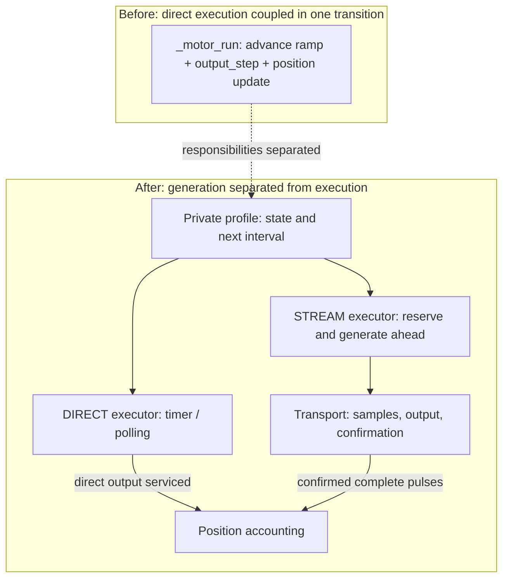
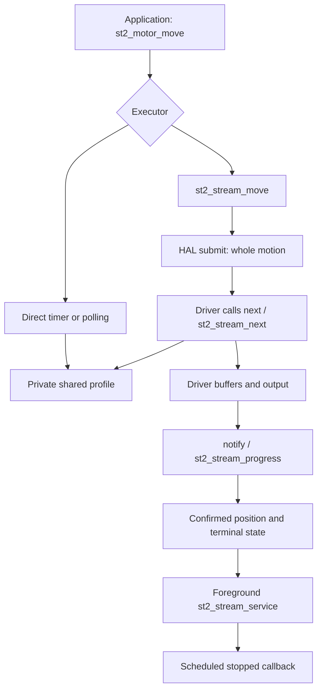
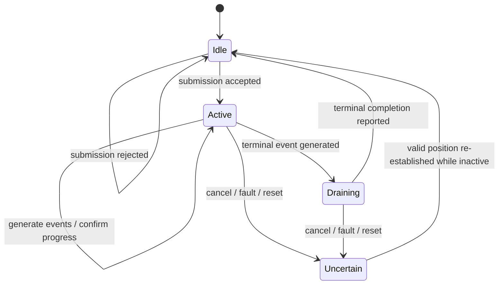

# Secondary-stepper stream injection

The secondary stepper can execute a finite motion through a buffered transport.
A shared motion profile supplies both the existing direct timer/polling executor
and the stream executor. This separates motion mathematics from output timing
without exposing the profile to a driver.

The essential distinction is **generated versus confirmed motion**. Generating
an event reserves future output; it does not establish that a pulse has left the
transport. Stream position advances only from cumulative full-pulse reports.

## Why the profile refactor comes first

Before the refactor, `_motor_run()` combined three responsibilities: advance
ramp state, call the direct step output, and update position. That coupling is
suitable for an executor servicing an output event immediately. A buffered
driver must calculate events ahead of output without prematurely changing the
reported position or emitting a GPIO pulse while merely filling a buffer.

Commit `dff5583` extracts private profile operations (including
`st2_profile_advance` and `st2_profile_request_stop`) and separates profile data
from executor state. The profile calculates progression; the executor decides
when and how to consume it, produce output and account for motion. This is the
architectural prerequisite for reusing the same ramp in a stream transport,
with one shared motion algorithm. The refactor itself retains
direct behavior and introduces no DMA/EOF implementation; `f628524` then adds
the stream contract and executor.

The same final direct suite gives the same serviced trace before and after the
refactor. That demonstrates preservation of the tested behavior across the new execution
boundary. Transport latency is characterized separately.

## Interfaces and ownership

| Type / interface | Visibility and responsibility |
|---|---|
| `st2_motor_t` in `stepper2.h` | Type declaration visible to applications; structure members are defined in `stepper2.c` |
| `st2_profile_t` | Private acceleration, cruise and deceleration state shared by the executors |
| Stream executor state | Private motion ID, generated/confirmed counts, active and completion flags |
| `injection_motion_t` | Core/driver contract: axis, direction, requested count, context and callbacks |
| `injection_event_t` | Relative delay in microseconds, STEP flag and terminal flag |
| `injection_progress_t` | Motion ID, cumulative completed full pulses and result |
| `stepper_injection_t` | Driver operations exposed through `hal.stepper.injection` |

The declaration `struct st2_motor;` in `stepper2.h` makes the type name visible
to callers. Applications pass `st2_motor_t *` to the public functions; the full
structure definition and access to its fields stay in `stepper2.c`. This C pattern
is commonly called an opaque type. Here it describes structure visibility,
independently of the lifetime or allocation of a particular motor instance.

The driver owns its buffers, queue and output checkpoints. It must preserve the
motion callback data it needs beyond `submit`; the caller's motion record can be
stack-local. The context referenced by that record must remain alive through
cancellation and any pending notification. An ID check prevents stale accounting;
it does not make a freed context safe.

## Transport contract and execution contexts

`supports(axis_mask)` describes transport capability. The caller holds the
transport lock for `submit` and `cancel`. A rejected submission must not call the
generator or accept a partial motion. Acceptance covers the whole motion, not
just the next buffer. The driver may pull the first event during submission.

The driver calls `next(context)` only after reserving an event slot and while
holding its lock. The generator must not allocate, block, call HAL or invoke
application callbacks. A terminal event can have no STEP: the profile's final
transition is not an extra output pulse.

The driver calls `notify` from its output-task context, outside the ISR and
driver lock. In the ESP32 implementation this is `i2sOutTask()` (`I2SOutTask`).
Core takes the lock while updating its executor. Reports carry cumulative counts,
not deltas. Core validates the active ID and count bounds, then adds only the
newly confirmed signed delta to position. A terminal result clears active state;
only successful completion schedules the normal stopped callback via foreground
service. `st2_motor_run` services this path; `st2_motor_poll` returns true for a
stream motor so foreground service continues even though it does not time pulses.

The lock must be a short recursive, ISR-safe cross-core critical section. Never
wait for completion or invoke application callbacks while holding it.

Draining names the phase between the last generated event and terminal
confirmation; it is represented by the existing profile and executor state. `st2_motor_running`
remains true until terminal notification, not merely until profile generation
ends. Controlled stop is a request consumed at the next unreserved event; already
buffered pulses remain. Braking can therefore complete at a different endpoint
from the originally requested move. Reset invalidates the active generation/ID;
cancelled or faulted motion marks position uncertain. `st2_set_position` can
establish a valid position only while inactive; choosing a correct reference is
the application's responsibility.

## Configuration and limits

Use `STEP_INJECT_STREAM=1` consistently across all participating translation
units: it changes the HAL layout. A supporting transport and an eligible
secondary motor are required. The stream path rejects non-finite arguments,
non-positive speed and infinite moves; it does not provide spindle streaming.
Speed is limited by the configured axis maximum. Nonzero in-flight finite stream
speed override is not implemented. A controlled stop uses `st2_motor_stop`.

The API accepts distances or step counts, with conversion in core. Pulse width,
output polarity, sample quantization and supported axes belong to the transport.
Each transport documents its electrical timing alongside those parameters.

## Validation and integration

The direct regression suite is described in
[tests/stepper2](../tests/stepper2/README.md). The same final suite passed 46,122
scenarios at each of `e07dffa` (finite-step fix), `dff5583` (profile refactor) and
`f628524` (stream executor), with serviced trace `17d7cd7b62360fa8`.
The companion ESP32 renderer at `739b0e9` passed 771 stream scenarios with core
`f628524`. Host execution used TinyCC 0.9.27.

The complete production `stepper2.c` with matching core headers compiled without
diagnostics using Xtensa ESP32 GCC 8.4.0 at `-O0` and `-O2`: refactor with stream
0, and final source with stream 0 and 1 (six compilations). This is translation-unit
compilation, not a full firmware link or a test on physical hardware.

The core changes build on the independent finite-step fix. Its two code
commits are profile refactoring followed by stream support. Companion repository
`grblHAL/ESP32` contains `doc/i2s-injection.md` for the complete implementation;
`grblHAL/Plugin_plasma` contains `doc/stream-injection.md` for position handover.
Matching companion revisions supply the transport and application integration.
